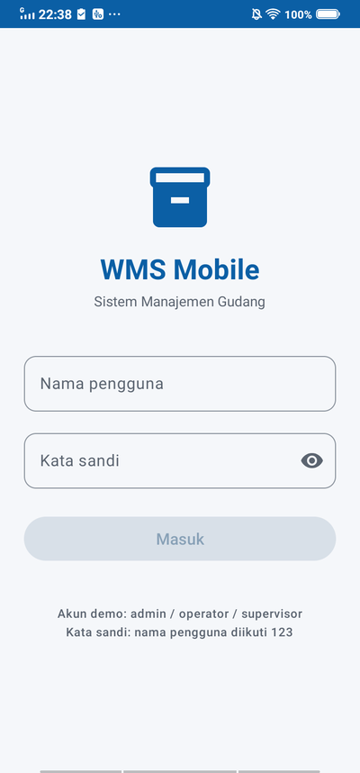
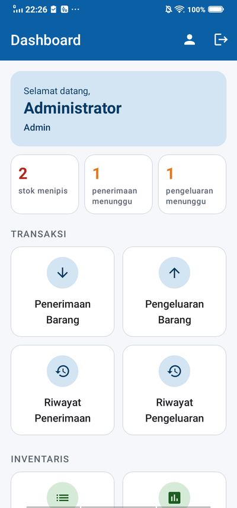
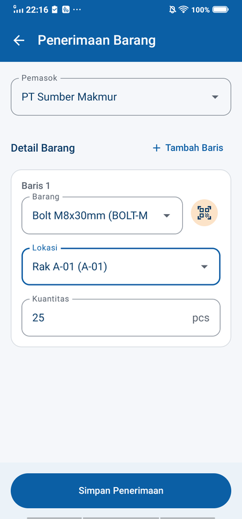
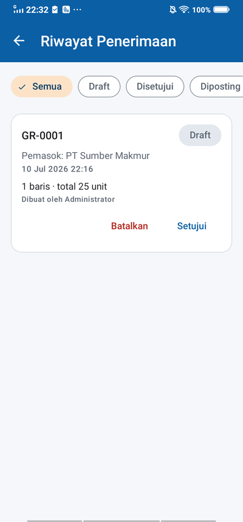
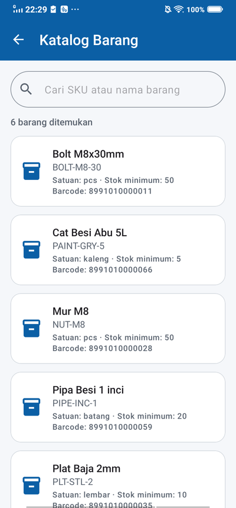
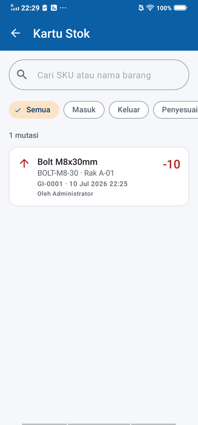
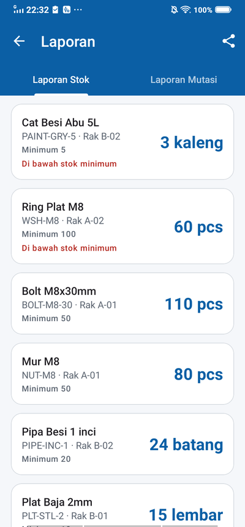
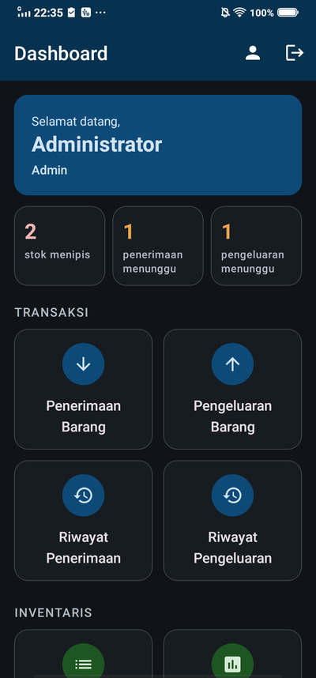
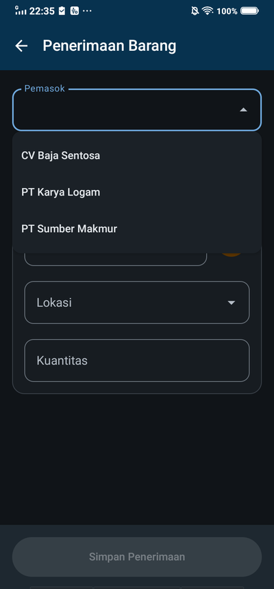

# WMS Mobile (Android · Kotlin)

Aplikasi **Warehouse Management System** versi mobile — implementasi dari desain
OOAD (UAS OOAD, WMS). Dibangun dengan **Kotlin Native**, arsitektur
**MVVM + Repository**, dan persistensi **Room**.

Lapisan tampilan memakai `AppCompatActivity` tunggal, `Fragment` di bawah
Navigation Component, dan `RecyclerView` untuk seluruh daftar. Tiga layar
formulir digambar dengan Jetpack Compose melalui `ComposeView`.

## Tautan

| Sumber | Tautan |
|---|---|
| Video demo aplikasi | https://drive.google.com/drive/u/0/folders/1ILAgGMi1evPY1RPioF806FjwYhpe6-9D |
| Dokumen desain OOAD | [Buka di Google Docs](https://docs.google.com/document/d/1bBeJVVsAAmToXrQMYOm4iHlNcDzRNlTU/edit?usp=sharing) |
| Laporan OOAD (PDF) | [docs/UAS_OOAD_WMS.pdf](docs/UAS_OOAD_WMS.pdf) |
| Berkas rilis | [apk/](apk/) |


## Fitur

Mengikuti Use Case Diagram pada dokumen OOAD: 21 use case, 4 aktor. Seluruhnya
sudah diimplementasikan.

| Paket | Use case | Status |
|---|---|---|
| Autentikasi | Login, Logout | ✅ |
| | View Profile | ✅ |
| Master Data | Manage Master Data (item, lokasi, pemasok) | ✅ |
| | Search Item, View Item Catalog | ✅ |
| Administrasi | Manage Users, Manage Roles | ✅ |
| Inbound | Create Goods Receipt | ✅ |
| | Approve Goods Receipt, View Receipt History | ✅ |
| | Scan Barcode | ✅ |
| Outbound | Create Goods Issue | ✅ |
| | Approve Goods Issue, View Issue History | ✅ |
| Inventory | View Stock | ✅ |
| | View Stock Movement, Stock Adjustment | ✅ |
| Reporting | Generate Stock Report, Generate Mutation Report | ✅ |
| | Export Report | ✅ |

Dokumen penerimaan dan pengeluaran barang mengikuti siklus
**Draft → Validated → Posted**, dan dapat dibatalkan selama belum `Posted`.
Stok hanya bergerak pada saat dokumen `Posted`. Seluruh pergerakan ditulis
dalam satu transaksi basis data, dan pengeluaran memeriksa ketersediaan seluruh
baris sebelum menulis apa pun, sehingga stok tidak pernah menjadi minus.

### Menu per peran

Dashboard menampilkan menu sebagai grid dua kolom yang dikelompokkan menjadi
empat kategori: Transaksi, Inventaris, Administrasi, dan Laporan. Kategori yang
kosong disembunyikan. Menu yang tampil disaring berdasarkan role pengguna.

| Peran | Jumlah menu | Kategori terisi | Yang tidak dilihat |
|---|---|---|---|
| Admin | 12 | 4 | — |
| Operator | 8 | 3 | administrasi, penyesuaian stok |
| Supervisor | 7 | 3 | administrasi, pembuatan dokumen |

Supervisor melihat lebih sedikit menu daripada Operator. Ia dapat menyetujui
dokumen dan menyesuaikan stok, tetapi tidak dapat membuat dokumen penerimaan
maupun pengeluaran. Angka-angka ini dikunci oleh `MenuUtamaTest`.

Di puncak Dashboard ada tiga kartu ringkasan yang dapat diketuk. Masing-masing
menghitung satu hal dan membuka satu layar:

| Kartu | Yang dihitung | Tujuan ketukan |
|---|---|---|
| stok menipis | stok di bawah stok minimum | Stok Gudang |
| penerimaan menunggu | penerimaan berstatus `DRAFT` | Riwayat Penerimaan |
| pengeluaran menunggu | pengeluaran berstatus `DRAFT` | Riwayat Pengeluaran |

Penerimaan dan pengeluaran sengaja dipisah menjadi dua kartu. Satu kartu
gabungan memaksa satu angka menunjuk ke dua layar sekaligus, sehingga separuh
dokumen yang dihitungnya tidak pernah dapat dicapai lewat kartu itu.

## Tema, bentuk, dan mode gelap

Seluruh warna berasal dari 24 token Material 3 yang didefinisikan dua kali —
`res/values/themes.xml` untuk mode terang dan `res/values-night/themes.xml`
untuk mode gelap. Layar Compose memakai token yang sama lewat `ui/theme/Theme.kt`,
sehingga layar XML dan layar Compose tidak pernah berbeda warna.

Latar toolbar sengaja tidak diambil dari `colorPrimary`, melainkan dari sumber
daya tersendiri `@color/latar_toolbar`. Alasannya, `colorPrimary` harus gelap
bila dipakai sebagai latar dan terang bila dipakai sebagai aksen — dua peran yang
saling bertentangan begitu mode gelap dinyalakan.

Warna status dokumen membentuk tangga yang bermakna:

| Status | Warna | Token |
|---|---|---|
| Draft | abu-abu | `colorSurfaceVariant` |
| Disetujui | jingga | `colorSecondaryContainer` |
| Diposting | hijau | `colorTertiaryContainer` |
| Dibatalkan | merah | `colorErrorContainer` |

### Bentuk

Material 3 memisahkan warna, tipografi, dan bentuk menjadi tiga sistem token
yang berdiri sendiri. Bila sistem bentuk dibiarkan kosong, setiap widget jatuh
ke nilai bawaan pustaka — dan bawaan untuk kolom teks adalah sudut 4dp, praktis
siku-siku. Karena itu tema mendefinisikan tangganya sendiri, dipakai bersama
oleh lapisan XML dan lapisan Compose.

| Token | Nilai | Yang memakainya |
|---|---|---|
| `shapeAppearanceCornerExtraSmall` | 12dp | kolom teks, dropdown, snackbar |
| `shapeAppearanceCornerSmall` | 12dp | chip |
| `shapeAppearanceCornerMedium` | 16dp | kartu |
| `shapeAppearanceCornerLarge` | 16dp | tombol aksi mengambang |
| `shapeAppearanceCornerExtraLarge` | 28dp | dialog |

Tangga yang sama ditulis ulang untuk Compose pada `ui/theme/Shape.kt`, sehingga
layar XML dan layar Compose tidak pernah berbeda bentuk. Bentuk tidak
bergantung pada mode gelap, jadi `res/values-night/` tidak memuatnya.

Tidak ada radius sudut yang ditulis langsung di layout. Chip status dan chip
filter berbentuk pil. Dua kolom pencarian memakai
`Widget.WMS.TextInputLayout.Pencarian` dan menjadi satu-satunya kolom teks
tanpa label melayang — pada kolom pencarian, isinya sudah menjadi labelnya
sendiri.

Aplikasi mengikuti setelan mode gelap sistem. Tidak ada sakelar di dalam
aplikasi.

## Cara clone dan menjalankan

```bash
git clone https://github.com/Xyzting/wms-mobile.git
cd wms-mobile
```

Lewat Android Studio (2024.1 / Koala ke atas):

1. **File → Open**, pilih folder hasil clone.
2. Tunggu **Gradle Sync** selesai. Berkas `local.properties` dibuat otomatis.
3. **Run** pada emulator atau perangkat Android, minimal Android 8.0 (API 26).

Lewat baris perintah:

```bash
./gradlew assembleDebug      # Windows: .\gradlew assembleDebug
./gradlew test               # menjalankan unit test
```

Wrapper Gradle sudah disertakan, jadi Gradle tidak perlu dipasang lebih dahulu.
Yang dibutuhkan hanya **JDK 17** dan **Android SDK API 34**.

### Akun demo

| Username | Password | Role |
|---|---|---|
| `admin` | `admin123` | Admin |
| `operator` | `operator123` | Operator |
| `supervisor` | `supervisor123` | Supervisor |

Data contoh dimuat otomatis saat aplikasi pertama kali dijalankan: enam item,
empat lokasi, tiga pemasok.

## Pengujian

Lima puluh tujuh unit test, berjalan tanpa perangkat maupun emulator.

| Berkas | Yang diuji |
|---|---|
| `InboundRepositoryTest` | siklus dokumen penerimaan, pergerakan stok saat posting |
| `OutboundRepositoryTest` | siklus dokumen pengeluaran, penolakan saat stok kurang |
| `InventoryRepositoryTest` | saldo stok, penyesuaian, kartu stok |
| `UserRepositoryTest` | autentikasi, pengelolaan pengguna dan role |
| `MenuUtamaTest` | komposisi menu Dashboard untuk ketiga peran |
| `DokumenUiTest` | wewenang aksi dokumen, pemetaan hasil operasi |

## Tangkapan layar

Seluruh gambar diambil dari perangkat sungguhan (720 × 1544, kerapatan 320).

| Masuk | Dashboard Admin | Penerimaan Barang |
|---|---|---|
|  |  |  |

| Riwayat Penerimaan | Katalog Barang | Kartu Stok |
|---|---|---|
|  |  |  |

| Laporan Stok | Dashboard mode gelap | Penerimaan mode gelap |
|---|---|---|
|  |  |  |

Formulir Penerimaan Barang adalah layar Compose; sisanya adalah layar XML.
Keduanya membaca token tema yang sama, sehingga pemisahan itu tidak terlihat
oleh pengguna.

## Struktur

```
app/src/main/java/com/utb/wms/
├── domain/
│   ├── model/        entity WMS (Item, Stock, GoodsReceipt, GoodsIssue, ...)
│   └── repository/   kontrak repository (interface)
├── data/
│   ├── local/        Room: entity, DAO, relasi, mapper, seeder
│   └── repository/   implementasi kontrak repository
├── di/               AppContainer (dependency injection manual)
└── ui/
    ├── theme/        token warna, tipografi, dan bentuk untuk layar Compose
    ├── common/       akses AppContainer, komponen Compose bersama, pemformat
    └── ...           Activity, Fragment, ViewModel, layar Compose
```

Aturan ketergantungan: `ui/` dan `data/` sama-sama bergantung pada `domain/`.
Paket `ui/` **tidak boleh** mengimpor `data/`.

## Komponen native yang dipakai

| Komponen | Contoh berkas |
|---|---|
| `Activity` | `MainActivity.kt` |
| `Fragment` | `ui/login/LoginFragment.kt` dan seluruh layar lain |
| `RecyclerView` | Dashboard, daftar stok, riwayat dokumen, katalog item |
| `Intent` | `ACTION_SEND` untuk ekspor laporan, `ACTION_DIAL` untuk kontak pemasok |

Pemindai barcode memakai `zxing-android-embedded` lewat `ScanContract`, sebuah
`ActivityResultContract` yang mengurus izin kamera sendiri.

## Pembagian kerja tim

Proyek ini dikerjakan empat orang. Aturan kolaborasi dan kepemilikan berkas ada
di [CONTRIBUTING.md](CONTRIBUTING.md).

| Peran | Anggota | NIM | Ruang lingkup |
|---|---|---|---|
| BE-1 | Reyhan Fathir Alamsyah | 24552011032 | Kerangka proyek, model, kontrak repository, Room, DI, navigasi |
| BE-2 | Nazka Yasir Alman Paluthi | 24552011087 | Implementasi kontrak repository + unit test |
| FE-1 | M. Hafizul Hadi | 24552011218 | Tema, Login, Dashboard, Profil, Master Data, Administrasi, Laporan |
| FE-2 | Radhitias Salman Syam | 24552011112 | Komponen bersama, Inventory, Penerimaan & Pengeluaran Barang |
